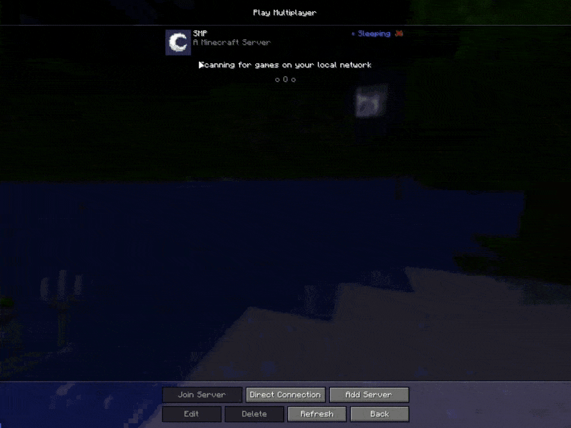

# Auto Start/Stop with Custom Ping Response

This example demonstrates AutoStartStop's core automation features: automatic server starting, stopping, and custom ping/MOTD responses. The configuration shows how to automatically start servers when players connect, stop them when empty, and customize server list responses based on server status.

## Configuration

```{ .yaml }
defaults:
  server:
    control_api:
      type: 'amp'
      ads_url: 'http://localhost:8080/'
      username: 'instance_management_bot'
      password: '123456789+Abc'
    startup_timer:
      auto_calculate_expected_startup_time: true

servers:
  smp:
    virtual_host: smp.example.com
    control_api:
      instance_id: 'f790deae-3fde-4049-8085-c51b19522526'
  limbo:
    control_api:
      instance_id: '8172f21e-5a16-473f-a3f1-12731a6b358a'

rules:
  start_on_proxy_start:
    template: 'start_on_proxy_start'
    servers: [limbo]
    
  stop_on_proxy_shutdown:
    template: 'stop_on_proxy_shutdown'
    servers: [limbo, smp]

  start_on_connection:
    template: 'start_on_connection'
    servers: [smp]
    mode: waiting_server
    waiting_server:
      server: limbo
      start_waiting_server_on_connection: true

  stop_on_empty:
    template: 'stop_on_empty'
    empty_time: 15m
    servers: [smp]
    
  respond_ping_smp:
    template: 'respond_ping'
    servers: [smp]
    offline:
      use_cached_motd: true
      version_name: '<blue>◉ Sleeping'
      protocol_version: -1
      icon: icons/smp-sleeping.png
    online:
      icon: icons/smp-icon.png
```

## Server Icons

The following icons are placed in the `icons` directory:

<div class="grid cards" markdown>

-   { .lg .middle } __`icons/smp-sleeping.png`__

    ---

    SMP server icon when offline

-   { .lg .middle } __`icons/smp-icon.png`__

    ---

    SMP server icon when online

</div>

!!! note "Icon Requirements"
    Server icons must be 64x64 pixel PNG images. You can place them in any directory accessible to the plugin.


## What This Configuration Does

This configuration demonstrates AutoStartStop's key automation features:

1. **Auto-start on connection**: Servers start automatically when players try to connect
2. **Auto-stop when empty**: Servers stop automatically after being idle
3. **Graceful shutdown**: All servers stop cleanly when the proxy shuts down
4. **Custom ping responses**: Server list shows different information based on server status

## Demo

Here's a demonstration of the configuration in action:


